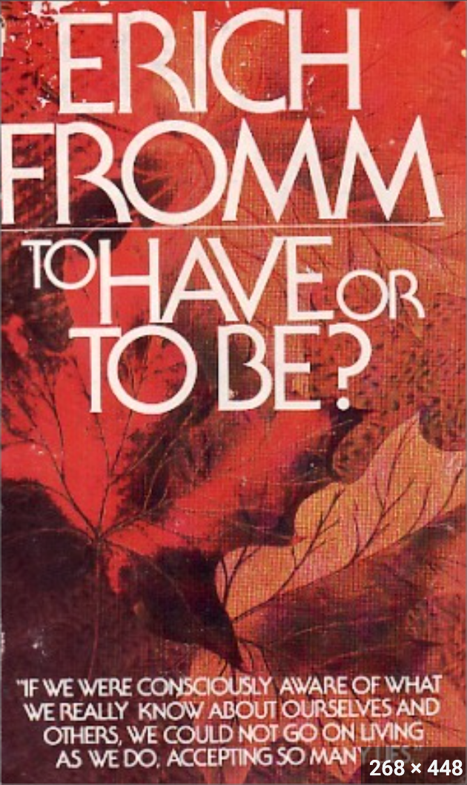

**“到2035年，世界上会有10亿个数字游民。”**

如果你有关注过“数字游民”，那么相信你一定在某些媒体报道上看到过类似的表述。

但是，这个预测到底从何而来，有何依据。真正知道的人并不多。

提出这个预测的不是别人，正是数字游民圈的头号网红，Nomadlist的创始人Pieter Levels。

2015年，在数字游民还没有进入绝大多数公众视野的时候，Levels受邀在德国柏林的DNX峰会上做了一场题为“The Future of Digital Nomads”的演讲。

这场演讲的全程录像可以在油管上找到。值得注意的，这条油管视频的标题是：“There Will Be 1 Billion Remote Workers by 2035 with Pieter Levels”

让我们来看看他是如何一步一步得到“2035年10亿”这个数字的：

首先，他说根据统计显示，2015年美国有30%的劳动人口是自由职业（Freelancer)，而美国人的人口统计代表了世界的一般水平。

他的原话是“This is America. It’s kind of representative of the general population.”（🐶）

他接下来预测，到2035年，这个比例会上升到50%。

这个预测很重要，因为它是后面计算得出10亿这个数字的重要因子之一。那么这个50%的数字是如何得到的呢？

按照他的演讲PPT，他首先在1990和2015两个数据点之间画了一条直线，然后在斜率几本不变的情况下对其进行了延长处理，从而得到了50%这个数字。

至于那根红线上那一折是怎么回事，他没做解释。我猜他也许是想让这幅图表显得更具有可信度吧，如果两根线都是笔直的直线，傻子都知道不可能。

他又花大量时间展示了很多关于发展趋势的数据图表，例如网速越来越快，机票越来越便宜，人们不再愿意结婚，不再愿意买房等。这部分且不说到底靠不靠谱，但跟“2035年10亿”的计算关系并不大，这里就不做分析了。

接下来到了关键部分，他说，2035年，世界上人口总数将达到90亿，这90亿中，除去老弱病残，有60亿是劳动人口。

而60亿劳动人口中，50%会是自由职业者（还记得上面那个预测么？），也就是30亿。

而这30亿自由职业者中，至少三分之一是数字游民/远程工作者。30亿除以三，我们最终得到了10亿这个数字。

复盘完整个得出结论的推导过程，我不知道你怎么想，我是觉得完全没有任何逻辑性和合理性。

60亿 X 50% X 1⁄3 = 10亿

这计算公式总共三个因子，每一个都不值得推敲。

首先，且不说2035年90亿总人口合不合理，为什么90亿人里面会有60亿的劳动人口？要知道现阶段我们世界的劳动人口也不足50%(大约33亿），我觉得未来只会更少。

其次，且不说2035年美国是否会有50%的人口变成自由职业者，美国的demographics真的能代表全世界么？这可是全世界最发达的经济体啊？！

最后，且不说是不是有1/3的自由职业者会变成远程工作者，远程工作者也不一定就是数字游民啊？

这里，需要回应一个非常常见的问题也就是，远程工作，自由职业者和数字游民到底有何区别？

在我看来：

1.首先，"数字游民"是一种生活方式，而"远程工作"和"自由职业"则是关于工作模式的描述，远程工作和自由职业只是两种财务上实现和支持数字游民生活方式的途径。

2.其次，并不是所有的远程工作者或自由职业者都是数字游民，同理，并不是所有的数字游民都是远程工作者或自由职业者。

3.最后，这个问题背后其实隐含着现代社会人们用工作来带定义一切的思维定式。人们习惯于用『职位描述』做自我介绍，习惯于通过一个人的职业来判断其所处的社会地位，习惯于让生活方式选择向职业选择妥协。

**强调数字游民是一种生活方式并不是在『咬文嚼字』，而是在倡导一种反思，即工作不是生活的全部，我们不应该用工作模式来定义生活方式。**

作为一名数字游民生活方式的推广者，我当然希望看到2035年世界上会有10亿个数字游民。

但是，作为一名数字游民生活方式多年的践行者，我也清晰地意识到，这样的生活方式并不适合所有人，确切地说是不适合大多数人。

**无论这个概念现在被炒得有多火，在可预见的将来，它将依然保持小众。**

引用或者传播这种明显不合理的虚妄夸大的预测数字，除了哗众取宠，吸引眼球之外，对于推广这种生活方式其实没有任何好处。

以上。
